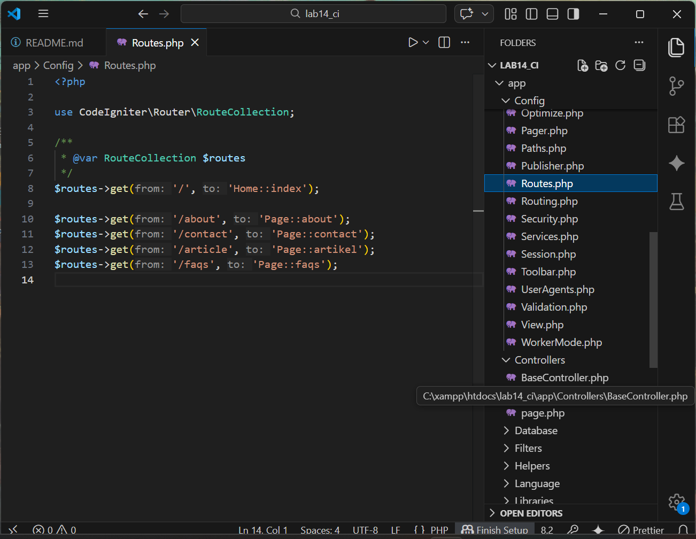
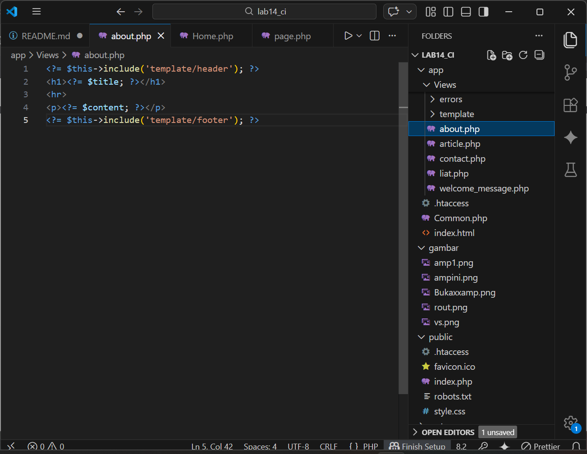
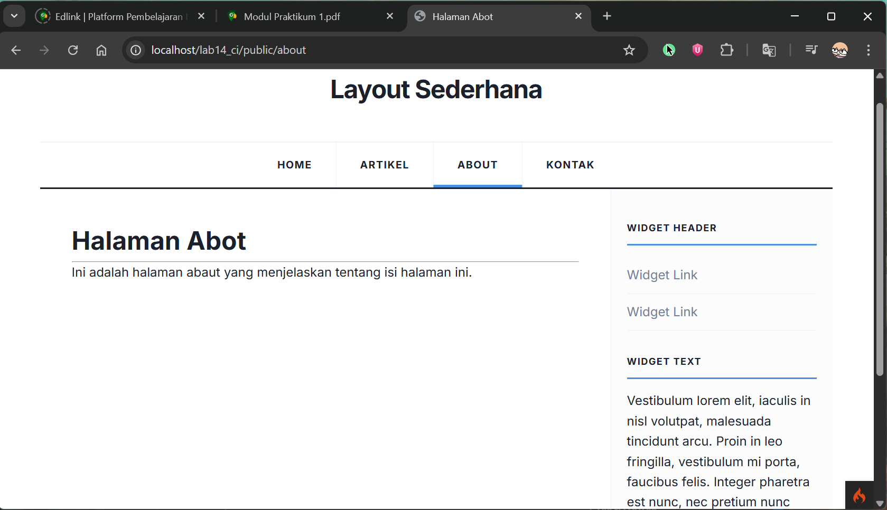
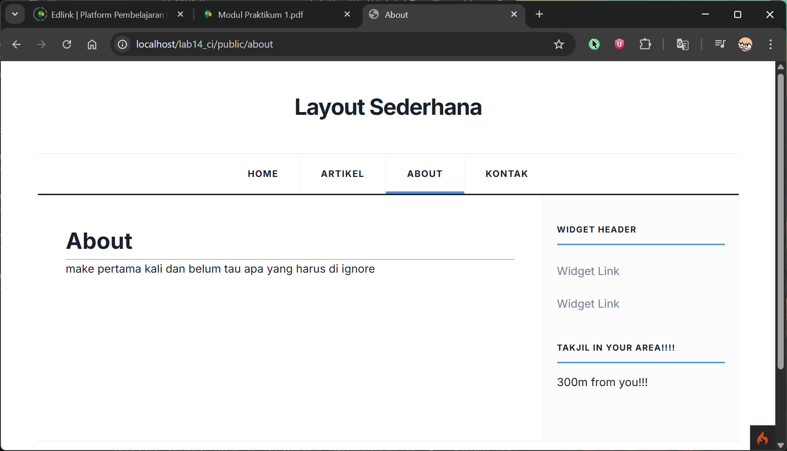
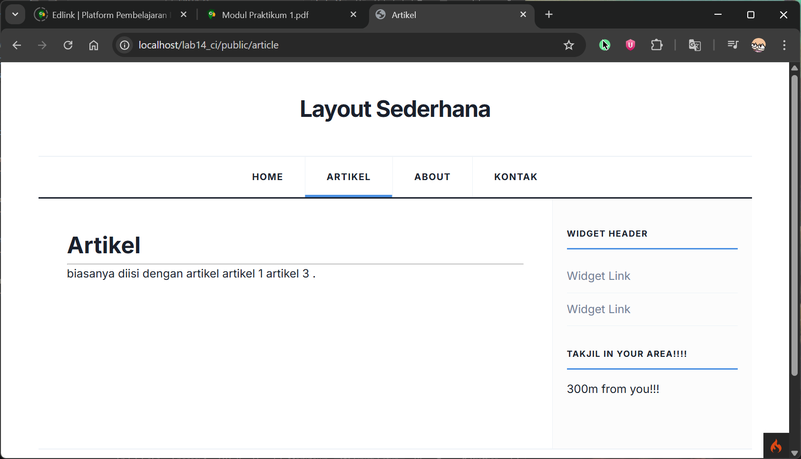

# Initiall Codeigniter

untuk WebApp simple


## Langkah-langkah 

1. **Persiapan**
    - Editornya, misal Visual Studio Code.
    
    
    - XAMPP, kalo belum punya unduh dulu di [sini](https://www.apachefriends.org/).

    - Buka XAMPP control panel dulu, aktifin ``apache`` lalu ke 

    buat aktifin 
    

    - Unduh [Codeigniter](https://codeigniter.com/download), ekstract isinya ke folder htdocs(ubah namanya juga biar gampang disebut).


2. **Penerapan**

    - Baca [ini](https://codeigniter.com/user_guide/installation/running.html#initial-configuration) buat instalasi, ikutin sampai set development mode.

    - Set up routes untuk file php klean di ```app/config/routes.php```
    

    - Buat [page.php](app/views/page.php) di dalam ```app/controllers```, itu buat ngasih arah ke filenya
    salah satunya ini. 
    ```php
    public function about()
    {
        return view('about', [ 
            'title' => 'Halaman Abot',
            'content' => 'Ini adalah halaman abaut yang menjelaskan tentang isi halaman ini.'
        ]);
    }
    ```

    - Nih [page](app/views/about.php) nya.
    

    - Tapi buat dulu [header](app/Views/template/header.php) dan [footer](app/Views/template/footer.php).

    - CSS nya ngambil dari repo [sebelumnya](https://github.com/laLafid/Lab4Web/blob/main/lab4_layout%2C/style.css).

    - Nanti hasilnya gini 


3. **Hasil Akhir**
    
    - [Home](app/Views/liat.php)
    

    - [About](app/Views/about.php)
    

    - [Artikel](app/Views/article.php)
    

    - [Kontak](app/Views/contact.php)
    

    
## Akhir Kata

*Selamat mencoba*
