# WebApp simple menggunakan Codeigniter 4

untuk WebApp simple pake framework Codeigniter 4 (4.7.2)

## Langkah-langkah 


1. **Persiapan**
    - Editornya, misal Visual Studio Code.
    
    
    - XAMPP, kalo belum punya unduh dulu di [sini](https://www.apachefriends.org/).

    - Buka XAMPP control panel dulu, aktifin ``apache`` dan ```mysql``` lalu ke ```php.ini```
    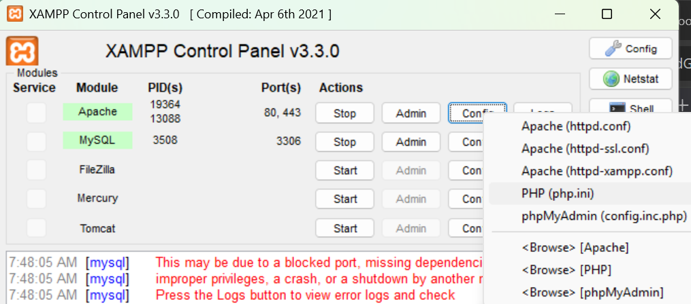 
    
    buat aktifin 
    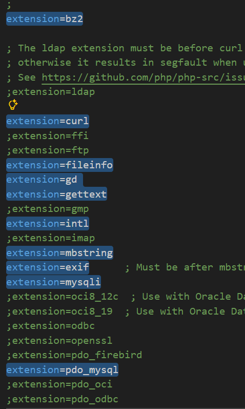


2. **Part 1 : Initiall Codeigniter**

    - Pertama-tama silahkan unduh Codeigniter 4 terlebih dahulu, bisa melalui [composer](https://getcomposer.org/) atau [manual](https://github.com/CodeIgniter4/framework/releases/tag/v4.7.2). Kedua cara tersebut sudah terdokumentasi dalam [User Guide Codeigniter 4](https://www.codeigniter.com/user_guide/installation/index.html) jadi teman-teman bisa ikuti instruksi disana.

    - Baca [ini](https://codeigniter.com/user_guide/installation/running.html#initial-configuration) buat configurasi awal sampai set ke development mode.

    - Disini akan menggunakan fitur [autoroute(improveed)](https://codeigniter.com/user_guide/incoming/auto_routing_improved.html#let-s-try-it-hello-world) dari Codeigniter4.
    
    - Buat [Page.php](app/views/Page.php) di dalam ```/app/controllers```, untuk memberi arah ke filenya seperti ini 
    autoroute: 
    ```php
    public function getAbout()
    {
        return view('about', [ 
            'title' => 'Halaman Abot'
        ]);
    }
    ```

    - hapus rute di dalam [Routes.php](app/Config/Routes.php) jadi seperti ini: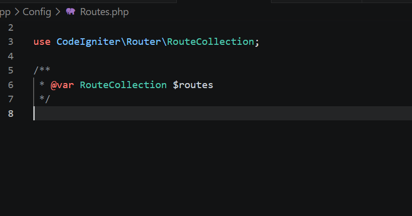 agar autoroute bisa berjalan normal. 

    - Buat folder ```template``` di ```/app/views``` isi pake file [header.php](app/Views/template/header.php) dan [footer.php](app/Views/template/footer.php).

    - Buat CSS dan taruh di ```/publik```.

    - Nanti hasilnya gini:
    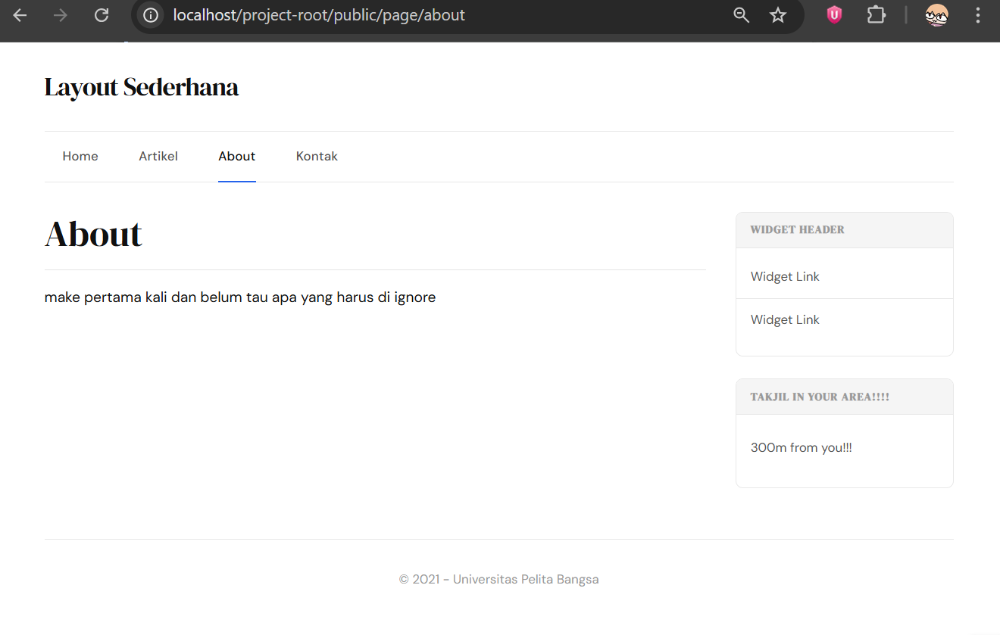


3. **Part 2 : DB dan CRUD** 

    - Buat db ```lab_ci4``` di mysql (pake phpmyadmin)

    buat table-nya
    ```sql
    CREATE TABLE artikel (
    id INT(11) auto_increment,
    judul VARCHAR(200) NOT NULL,
    isi TEXT,
    gambar VARCHAR(200),
    status TINYINT(1) DEFAULT 0,
    slug VARCHAR(200),
    PRIMARY KEY(id)
    );
    ``` 

    - Set up [.env](.env) nya biar baca db
    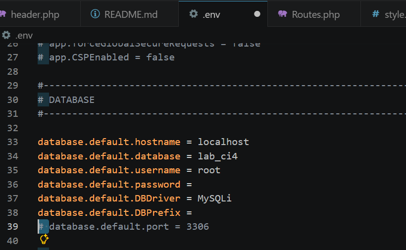

    - Buat model untuk proses data artikel, di dalam folder ```app/models``` buat [ArtikelModel](app/Models/ArtikelModel.php)
    ```php
    <?php 
    namespace App\Models; 
    use CodeIgniter\Model; 
    class ArtikelModel extends Model 
    { 
        protected $table = 'artikel'; 
        protected $primaryKey = 'id'; 
        protected $useAutoIncrement = true; 
        protected $allowedFields = ['judul', 'isi', 'status', 'slug', 
    'gambar']; 
    
    } 
    ```

    - Buat controller nya juga di ```app/controllers``` bikin [Admin.php](app/Controllers/Admin.php) dan [Artikel.php](app/Controllers/Artikel.php).

    - Buat folder ```artikel``` di ```app/Views``` isi pake [index.php](app/Views/artikel/index.php) 
    ```php
    <?= $this->include('template/header'); ?><?php if ($artikel):
     foreach ($artikel as $row): ?>
        <article class="entry">
            <h2<a href="<?= base_url('/artikel/' . $row['slug']); ?>"><?= $row['judul']; ?></a></h2>" alt="<?= $row['judul']; ?>">
                <p><?= substr($row['isi'], 0, 200); ?></p>
        </article>
        <hr class="divider" /><?php endforeach; else: ?>
    <article class="entry">
        <h2>Belum ada data.</h2>
    </article><?php endif; ?><?= $this->include('template/footer'); ?> 
    ```

    - Masukin data ke tabel ```artikel``` di db
    ```sql
    INSERT INTO artikel (judul, isi, slug) VALUE
    ('Artikel pertama', 'Lorem Ipsum adalah contoh teks atau dummy dalam industri percetakan dan penataan huruf atau typesetting. Lorem Ipsum telah
    menjadi standar contoh teks sejak tahun 1500an, saat seorang tukang cetak
    yang tidak dikenal mengambil sebuah kumpulan teks dan mengacaknya untuk
    menjadi sebuah buku contoh huruf.', 'artikel-pertama'),
    ('Artikel kedua', 'Tidak seperti anggapan banyak orang, Lorem Ipsum
    bukanlah teks-teks yang diacak. Ia berakar dari sebuah naskah sastra latin
    klasik dari era 45 sebelum masehi, hingga bisa dipastikan usianya telah
    mencapai lebih dari 2000 tahun.', 'artikel-kedua');
    ```

    - Nah, buat folder artikel di ```app/Views``` isi pake [index.php](app/Views/index.php), [detail.php](app/Views/artikel/detail.php), buat folder admin di ```app/Views/artikel``` isi pake [admin_index.php](app/Views/artikel/admin_index.php), [form_add.php](app/Views/artikel/form_add.php), [form_edit.php](app/Views/artikel/form_edit.php).

    - Di ```app/Views/template``` tambahin [admin_header.php](app/Views/template/admin_header.php) dan [admin_footer.php](app/Views/template/admin_footer.php).

    - Tampilan nya:
    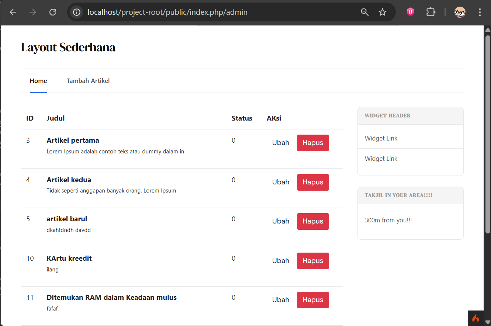


4. **Part 3 : View Layout dan View Cell**
    - Buat folder layout di dalam ```app/Views/``` isi pake [main.php](app/Views/layout/main.php)

    - Ubah [Home.php](app/Views/vi/home.php) yang ada di ```app/Views/vi`` untuk menggunakan layout [main.php](app/Views/layout/main.php)
    ```php
    <?= $this->extend('layout/main') ?>
    <?= $this->section('content') ?>
    <h1><?= $title; ?></h1>
    <hr>
    <p>hay homiee</p>
    <?= $this->endSection() ?>
    ```

    - Buat folder ``Cells`` di dalam ``app/`` Buat file [ArtikelTerkini.php](app/Cells/ArtikelTerkini.php) di dalam ``app/Cells/`` , tambahin juga field baru ke table ``artikel`` di DB
    ```sql
    ALTER TABLE artikel add created_at TIMESTAMP DEFAULT CURRENT_TIMESTAMP;
    ```

    - Buat folder ``components`` di dalam ``app/Views/`` didalemnya isi [artikel_terkini.php](app/Views/components/artikel_terkini.php)
    ```php
    <?php
    namespace App\Cells;
    use App\Models\ArtikelModel;
    class ArtikelTerkini
    {
            public function render(string $kategori = 'umum')
        {
            $model = new ArtikelModel();
            $artikel = $model
                ->where('kategori', $kategori)
                ->orderBy('created_at', 'DESC')
                ->limit(5)
                ->findAll();

            return view('components/artikel_terkini', [
                'artikel'   => $artikel,
                'kategori'  => $kategori
            ]);
        }
    }
    ```

    - Beberapa perubahan untuk menampung opsi kategori 

    dalam DB, 
    ```sql
    ALTER TABLE artikel add COLUMN kategori VARCHAR(100) DEFAULT 'umum'; //perubahan baru
    ```
    
    di [form_edit.php](app/Views/artikel/form_edit.php) dan [form_add.php](app/Views/artikel/form_add.php)
    ```php
        <select name="kategori">
            <option value="umum">Umum</option>
            <option value="teknologi">Teknologi</option>
            <option value="berita">Berita</option>
        </select>
    ```

    di ``Controller/Admin.php``, bagian postEdit dan postAdd tambahin ini (detailnya bisa dilihat [langsung](app/Controllers/Admin.php))  
    ```php
    
                'kategori' => $this->request->getPost('kategori'),
    ```

    di ``/App/Models/ArtikelModel.php`` tambahkan ``'kategori', 'created_at'`` ke dalam field allowed.


    - Akhirnya seperti ini:
    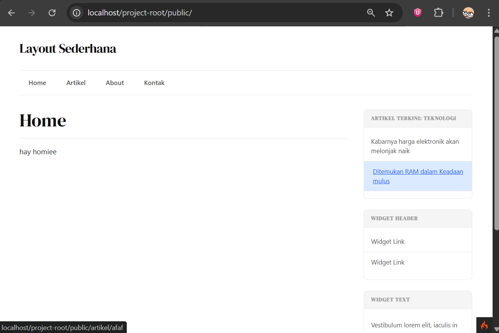


5. **Part 4 : Modul Login**
    - Membuat Tabel ``user`` di DB
    ```sql
    CREATE TABLE user (
    id INT(11) auto_increment,
    username VARCHAR(200) NOT NULL,
    useremail VARCHAR(200),
    userpassword VARCHAR(200),
    PRIMARY KEY(id)
    );
    ```

    - Selanjutnya adalah membuat Model untuk memproses data Login. Buat file baru pada direktori ```app/Models``` dengan nama [UserModel.php](app/Models/UserModel.php).
    isi dengan :
    ```php
    <?php
    namespace App\Models;
    use CodeIgniter\Model;
    class UserModel extends Model
    {
        protected $table = 'user';
        protected $primaryKey = 'id';
        protected $useAutoIncrement = true;
        protected $allowedFields = ['username', 'useremail', 'userpassword'];
    }
    ```

    - Controller baru [User.php](app/Controllers/User.php).

    - Buat direktori baru dengan nama ``user`` pada direktori ``app/views`` , kemudian buat file [Login.php](app/Views/user/login.php).

    - Membuat Database Seeder untuk keperluan ujicoba, . Buka CLI, kemudian tulis perintah: ```php spark make:seeder UserSeeder```

    - Selanjutnya, buka file [UserSeeder.php](app/Database/Seeds/UserSeeder.php) di ```/app/Database/Seeds/```
    isi dengan: 
    ```php
    <?php
    namespace App\Database\Seeds;
    use CodeIgniter\Database\Seeder;
    class UserSeeder extends Seeder
    {
    public function run()
        {
            $model = model('UserModel');
            $model->insert([
            'username' => 'admin',
            'useremail' => 'admin@email.com',
            'userpassword' => password_hash('admin123', PASSWORD_DEFAULT),
            ]);
        }
    }
    ```

    -  Buka kembali CLI dan ketik ```php spark db:seed UserSeeder``` lalu buka di browser ``http://localhost/project-root/public/user/login`` (sesuaikan dengan nama project klean).

    - Menambahkan Auth Filter dengan menambahkan [Auth.php](app/Filters/Auth.php) di ```/app/Filters/```
    ```php
    <?php
    namespace App\Filters;
    use CodeIgniter\HTTP\RequestInterface;
    use CodeIgniter\HTTP\ResponseInterface;
    use CodeIgniter\Filters\FilterInterface;
    class Auth implements FilterInterface
    {
        public function before(RequestInterface $request, $arguments = null)
        {
            // jika user belum login
            if (!session()->get('logged_in')) {
                // maka redirct ke halaman login
                return redirect()->to('/user/login');
            }
        }
        public function after(
            RequestInterface $request,
            ResponseInterface
            $response,
            $arguments = null
        ) {
            // Do something here
        }
    }
    ```

    - Tambahin ```'auth' => \App\Filters\Auth::class``` di ``app/Config/Filters.php``
    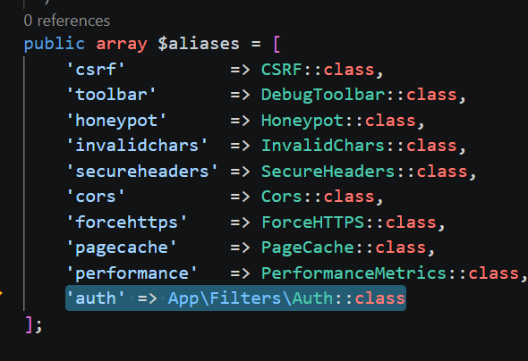, 
    
    dan ``use CodeIgniter\Router\Attributes\Filter #[Filter(by: 'auth')]`` di ``app/Controllers/Admin.php`` 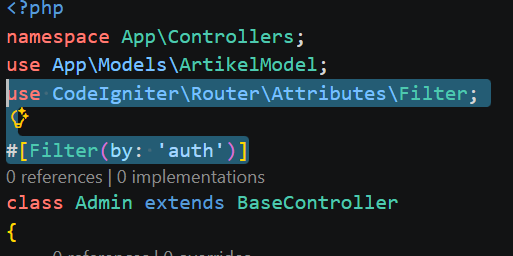

    Kemudian bisa langsung coba akses ``http://localhost/project-root/public/admin/add`` sebelum login (#nanti kena redirect ke login page).

    - Tambahin fungsi logout di ``Controllers/User.php`` 
    ```php
    public function getLogout()
    {
        session()->destroy();
        return redirect()->to('/user/login');
    }
    ```

    - Tampilan login nya:
    


6. **Part 5 : Pagination dan Pencarian**
    - Buat paging di index admin dengan model paginasi yang tersedia, ke ``app/Controller/Admin.php`` dan tambahin beberapa line ini 
    ```php
    $model = new ArtikelModel();
        $artikel = $model->findAll();
        $data = [
            'title' => $title,
            'artikel' => $model->paginate(10), #data dibatasi 10 record per halaman
            'pager' => $model->pager,
        ];
        return view('artikel/admin_index', $data);
    ```

    - Untuk menampilkan page, ke ``app/Views/artikel/admin_index.php`` tambahin ini: ``<?= $pager->links(); ?>`` tepat dibawah table.
    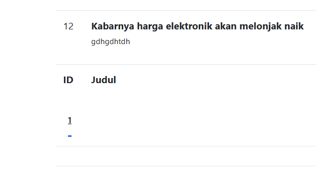
    <sub>*abaikan angka 12 itu, numbering disana agak rancu (ada data yang dihapus)*<sub>
    m


## Hasil Akhir

1. **Gambar**

    **Admin**:

    [Admin Dashboard](app/Views/artikel/admin_index.php)
    

    [Edit Artikel](app/Views/artikel/form_edit.php)
    

    [Add Artikel](app/Views/artikel/form_add.php)
    

    **Login Page**:
    [Login](app/Views/user/login.php)
    

    **User**:

    [Home](app/Views/vi/home.php)
    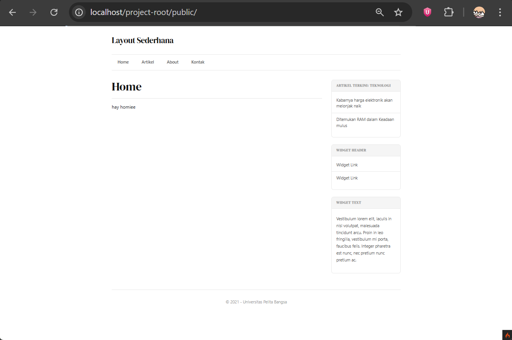

    [About](app/Views/vi/about.php)
    

    [Artikel](app/Views/artikel/index.php)
    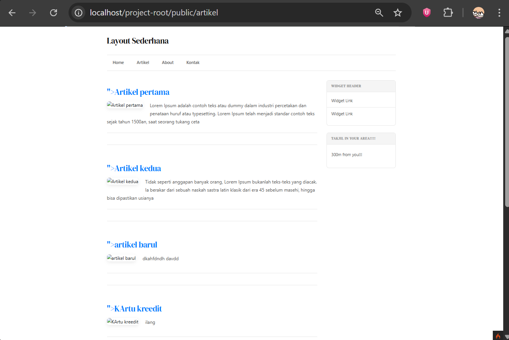
    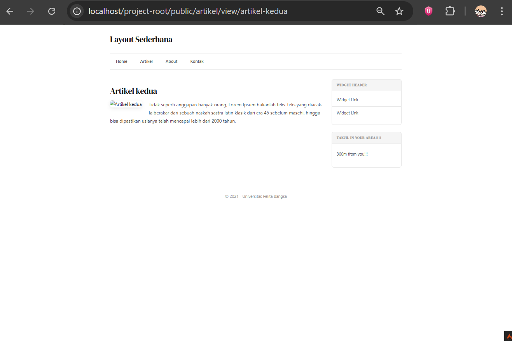

    [Kontak](app/Views/vi/contact.php)
    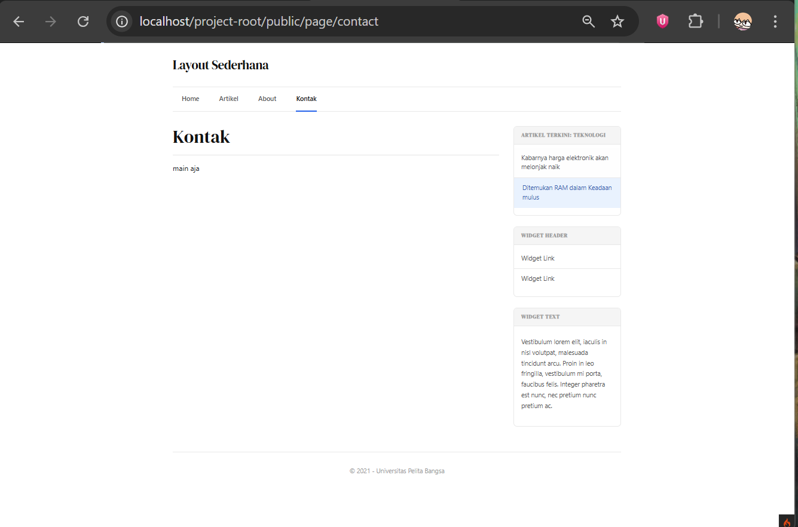
    

## Akhir Kata

*Selamat mencoba*
